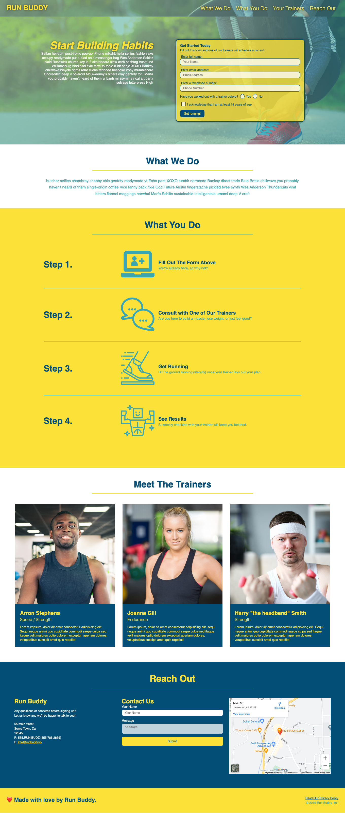

# Run Buddy, Inc

## Purpose
In this project we learn to use HTML and CSS in a landing page for Run Buddy, a service website that allows customers to sign up for personal training.

## Built With 
* HTML
* CSS

## Website Link
https://itzamary.github.io/run-buddy/

## Image

## Contribution
Made with ❤️ by Itzamary Jimenez.

### ©️2019 Run Buddy, Inc
